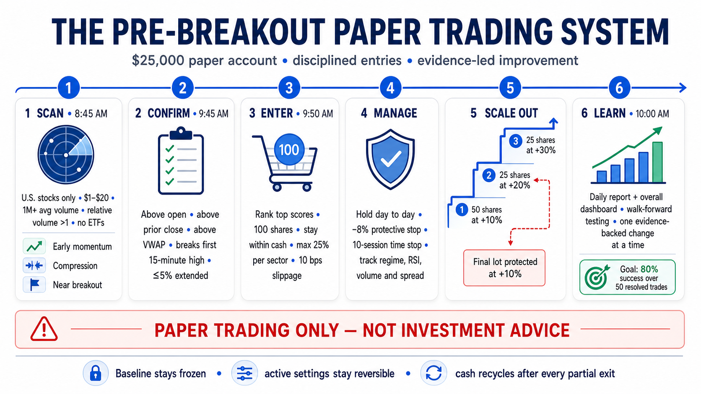
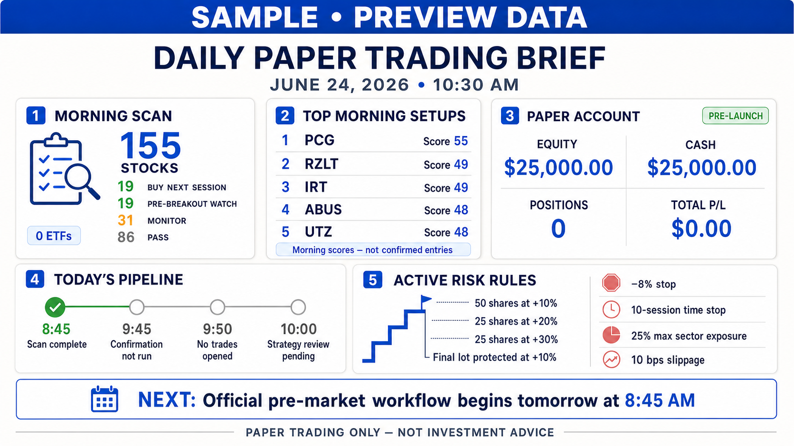

# Pre-Breakout Paper Trading System

A local Python workflow that finds controlled swing-trade setups, confirms them
after the opening volatility, manages a $25,000 paper account, and improves the
strategy using resolved outcomes instead of intuition.

> Paper trading only — not investment advice. Finviz and Yahoo data may be
> delayed, incomplete, or unavailable.



## Daily workflow

All times are America/New_York. The jobs run automatically Monday through
Friday and can also be run independently.

| Time | Job | Result |
|---|---|---|
| 8:45 AM | `morning_candidates.py` | Raw and scored stock universe |
| 9:50 AM | `confirm_945.py` | Completed-bar VWAP, trend, breakout, and live quote check |
| 10:10 AM | `daily_report.py` | Entries, exits, health audit, account report, and dashboard |
| 10:25 AM | Strategy optimizer | Holdout-tested, guarded parameter review |
| 10:45 AM | Daily infographic | Visual summary posted in Codex |
| Friday 4:10 PM | Human review | Read-only audit of every evaluated strategy change |



## 1. Morning stock scan

Finviz supplies the starting universe:

- U.S. stocks only; ETFs and ETNs are excluded twice for safety.
- Price under $20, average volume above 1 million, relative volume above 1.
- Positive weekly performance.

Yahoo daily history then scores each stock for early weekly momentum, a
controlled daily move, healthy RSI, 20/50-day trend, compression, prior
accumulation, proximity to a 20-day breakout, manageable downside, and useful
volume. Exhausted moves, RSI above 75, weekly overextension, and volume mania
receive explicit penalties.

| Score | Morning signal |
|---:|---|
| 42+ | 🔥 Buy next session |
| 35–41 | 👀 Pre-breakout watch |
| 26–34 | 🟡 Monitor |
| Below 26 | 🔴 Pass |

## 2. 9:50 confirmation

Five-minute data confirms whether a setup is behaving correctly after the
open. The score rewards price above the open, prior close, and VWAP; a break of
the first 15-minute high; and remaining within 5% of the open. Moves above 8%
are penalized as overextended.

| Score | Confirmation signal |
|---:|---|
| 40+ | 🔥 Buy today |
| 25–39 | 👀 Wait |
| Below 25 | 🔴 Pass |

Each confirmation also records sector, RSI, market regime, SPY five-day return,
confirmation volume, actual bid/ask when available, five-minute spread fallback,
earnings proximity, score band, and every scoring component that fired.

## 3. Paper-account rules

- Starting capital: **$25,000**
- Entry size: **dynamic**, risking at most **0.5% of current equity** at the stop
- Maximum: **one new confirmed trade per day** and **six open positions**
- Position ceiling: **10% of current equity**
- Sector ceiling: **20% of current equity** and **one open position per sector**
- Portfolio heat ceiling: **3% of current equity at the active stops**
- Cash reserve: at least **40% of current equity**
- Earnings blackout: **no new entry within five market sessions of earnings**
- Live bid/ask spread ceiling: **1% when an actual quote is available**
- Simulated slippage: **10 basis points on every entry and exit**
- Same-day duplicates and already-open tickers are rejected
- Partial-sale proceeds immediately return to available paper cash

Trades remain open from day to day. Every dynamically sized position scales out
by percentage as follows:

1. Sell 50% of the initial shares at **+10%**.
2. Immediately move the protective stop on the balance to **breakeven**.
3. Sell 25% of the initial shares at **+20%**.
4. Sell the final shares at **+30%**.
5. After +20% is reached, protect the final lot with a fallback exit at **+10%**.

An **−8% stop** or **10-session time stop** closes every share still held. If a
target and stop occur inside the same five-minute bar, the system conservatively
records the stop first. Exit processing is idempotent, so rerunning a report
cannot sell the same tranche twice.

Stop fills are gap-aware: if a bar opens below the stop, the simulated fill uses
the worse opening price plus slippage rather than pretending the stop price was
available. Active positions are adjusted for reported stock splits. Three
consecutive missing-data checks flag a position for symbol-change, merger,
delisting, or data-source review rather than inventing an exit.

## 4. Reporting and dashboard

`daily_report.py` maintains the complete lot-aware ledger in PostgreSQL. Pipeline
handoffs (morning candidates, 9:45 confirmations, daily performance) are stored
as dated PostgreSQL snapshots. HTML reports under `exports/` are read-only views.
The permanent dashboard lives at:

```text
exports/dashboard.html
```

The dashboard shows account equity, cash, deployed capital, realized and
unrealized P/L, open and resolved trades, staged exits, daily equity history,
score-band performance, signal contribution, and active risk controls.
The dashboard also exposes pipeline health. Each stage checks the exchange
calendar and refuses stale upstream snapshots; low history or intraday coverage is
marked `DEGRADED` instead of being hidden.

## 5. Continuous improvement

`strategy_baseline.json` is immutable baseline v1. Active, reversible settings
live in `strategy_settings.json`, experiment safeguards live in
`optimizer_policy.json`, and every evaluated change belongs in
`strategy_changelog.csv`.

The 10:00 AM optimizer:

- Defines success as reaching the +10% scale-out before the −8% stop.
- Waits for at least 60 resolved trades before tuning.
- Reserves the newest 20% as a frozen chronological holdout with at least 12
  trades; it is never used to select parameters.
- Uses chronological walk-forward testing on the remaining history.
- Evaluates hit rate, expectancy, profit factor, drawdown, regime, sector,
  spread, score band, and signal components.
- Ranks strategy quality by realized expectancy, profit factor, maximum
  drawdown, +10% hit rate, and time required to reach +10%, in that order.
- Adopts at most one evidence-backed setting change per day.
- Never weakens capital, slippage, stop, concentration, or sample safeguards to
  inflate the hit rate.
- Stops tuning after at least 80% success over the latest 50 resolved trades,
  while continuing to monitor performance.
- Refuses adoption on a dirty worktree and creates a local git rollback commit
  for every adopted settings change; it never pushes automatically.

The Friday review is read-only and reports whether each change should be kept,
reverted, or watched. It does not edit the strategy.

## Project layout

```text
stock/
├── scanner_config.py          # Paths, account values, active strategy settings
├── morning_candidates.py      # Finviz universe and daily technical scoring
├── confirm_945.py             # Intraday confirmation and entry telemetry
├── daily_report.py            # Entries, staged exits, ledger, and reports
├── dashboard.py               # Permanent account dashboard
├── backtest.py                # Historical confirmation replay
├── strategy_baseline.json     # Frozen baseline v1
├── strategy_settings.json     # Active reversible parameters
├── strategy_changelog.csv     # Optimization audit trail
├── optimizer_policy.json      # Sample, holdout, and adoption safeguards
├── market_calendar.py         # NYSE-session automation gate
├── pipeline_health.py         # Stage state, coverage, and PostgreSQL snapshot checks
├── system_health.py           # Standalone health-audit command
├── db.py                      # PostgreSQL connection and schema bootstrap
├── stock_storage.py           # Paper ledger and analytics persistence
├── job_storage.py             # Scheduler job history
├── app_server.py              # Web UI, API, and job runner
├── docker-compose.yml         # App + PostgreSQL (local/dev)
├── docker-compose.pi.yml      # Pi: host network on port 80 + host PostgreSQL
├── deploy/db_backup_git.sh    # Nightly pg_dump → backups/ → git push
├── backups/                   # PostgreSQL dumps (committed nightly on Pi)
├── assets/
│   ├── overview.png
│   └── daily_message.png
├── exports/                   # HTML dashboard, reports, and infographics
└── logs/
```

## Setup

Requires Python 3.9 or newer:

```bash
cd /Users/dadon003/code/stock
python3 -m pip install pandas yfinance finvizfinance "urllib3<2"
mkdir -p exports logs
```

The `urllib3<2` constraint avoids the common LibreSSL warning with Apple's
Xcode Python. Override the project root with
`STOCK_SCREENER_HOME=/another/path`; individual paths and account values can be
overridden using the environment variables in `scanner_config.py`.

Run the core workflow manually:

```bash
python3 morning_candidates.py
python3 confirm_945.py
python3 daily_report.py
```

## Running the app (Docker)

The recommended way to run the stack is Docker. The web UI listens on **port 80**.

### Raspberry Pi (host PostgreSQL + port 80)

PostgreSQL should already be installed on the Pi. Create the database once:

```bash
sudo -u postgres psql -f deploy/setup_postgres.sql
```

Copy `.env.example` to `.env`, adjust `POSTGRES_PASSWORD`, then bootstrap:

```bash
chmod +x deploy/pi_bootstrap.sh
./deploy/pi_bootstrap.sh
```

Open `http://raspberrypi.local/` from your PC. The container uses host networking,
connects to PostgreSQL on `127.0.0.1`, and restarts automatically with Docker's
`unless-stopped` policy.

Optional systemd unit for boot-time start:

```bash
sudo cp deploy/stocktrading.service /etc/systemd/system/
sudo systemctl enable --now stocktrading
```

Set `STOCK_IMAGE_PYTHON` in `.env` if you want the P/L flash-card job to use
Codex's bundled Python instead of the container Python.

### Local/dev (bundled PostgreSQL)

```bash
cp .env.example .env
docker compose up -d --build
```

Open `http://localhost/`.

### What the app serves

The app serves the dashboard, exposes `/api/status`, and runs trading jobs when
triggered by **systemd timers** on the Pi (or an optional in-process loop for
local dev). The scheduled-jobs screen at `/jobs` shows every job, next run,
last result, run history, and lets you run the morning scan, confirmation,
report, strategy review, health, and dashboard jobs on demand.
The main app also includes an **Inject $25,000 bankroll** button. It records a
paper deposit in PostgreSQL account events, rebuilds the dashboard, and keeps the
deposit separate from trading P/L.
The date-specific status page at `/day?date=YYYY-MM-DD` reads from PostgreSQL,
showing job runs, pipeline status, strategy review rows, paper performance,
score bands, components, and the paper ledger for that date.
Job history, paper trades, pipeline snapshots, performance analytics, score-band
analytics, component analytics, and strategy-review rows all live in PostgreSQL.
HTML under `exports/` is generated for browser viewing only. The 10:30 strategy
review writes `exports/strategy_review_YYYY-MM-DD.html`, and the dashboard shows
the latest decision, sample gates, holdout status, latest-50 success, and job
health. While the market is open, it refreshes the paper-trading report and
dashboard every five minutes after the same-day confirmation snapshot exists.
Override `PORT`, `HOST`, `DATABASE_URL`, `STOCK_SCHEDULER`, or
`STOCK_LIVE_UPDATE_SECONDS` in `.env` if needed.

### Scheduled jobs (systemd on Raspberry Pi)

Trading jobs are **not** cron and **not** an in-app polling loop on the Pi.
`docker-compose.pi.yml` sets `STOCK_SCHEDULER=systemd`, and host timers call
the app API:

| Timer | Time (ET) | Job |
|-------|-----------|-----|
| `stocktrading-job-morning.timer` | 8:45 Mon–Fri | morning scan |
| `stocktrading-job-confirmation.timer` | 9:50 | 9:45 confirmation |
| `stocktrading-job-report.timer` | 10:10 | daily report |
| `stocktrading-job-strategy_review.timer` | 10:30 | strategy review |
| `stocktrading-job-pnl_flashcard.timer` | 16:15 | P/L flashcard |
| `stocktrading-live-update.timer` | every 5 min | live report/dashboard |
| `stocktrading-db-backup.timer` | 2:30 daily | PostgreSQL dump → git |

Each timer runs `deploy/trigger_job.sh` (or `trigger_live_update.sh` / `db_backup_git.sh`), which
skips non-market days and `POST`s to `http://127.0.0.1/api/run/<job>` (backup runs `pg_dump` and `git push`). Logs:
`logs/systemd_jobs.log`, `logs/db_backup.log`.

Install or refresh timers after a pull:

```bash
./deploy/install_systemd_jobs.sh
systemctl list-timers 'stocktrading-*'
```

For local dev without systemd, set `STOCK_SCHEDULER=internal` to use the
background loop inside `app_server.py`.

### Auto-deploy from git (Raspberry Pi)

After `./deploy/pi_bootstrap.sh`, a systemd timer runs every **5 minutes**:

1. `git fetch origin main`
2. If the commit changed → `git pull` → `docker compose build` → `docker compose up -d`

Logs: `logs/pull_redeploy.log`

Install or refresh the timer manually:

```bash
sudo cp deploy/stocktrading-pull.{service,timer} /etc/systemd/system/
sudo systemctl daemon-reload
sudo systemctl enable --now stocktrading-pull.timer
```

Bump `VERSION` in the repo when you want a visible release number on the
dashboard header (shown alongside the git commit and build timestamp).

## Historical replay

Use a candidate snapshot from the requested date whenever possible:

```bash
python3 backtest.py \
  --date 2026-06-23 \
  --candidates exports/finviz_raw_2026-06-23.csv
```

If `--candidates` is omitted, the newest snapshot is used and the report is
clearly marked as look-ahead biased. Historical results are research evidence,
not a prediction of future performance.
